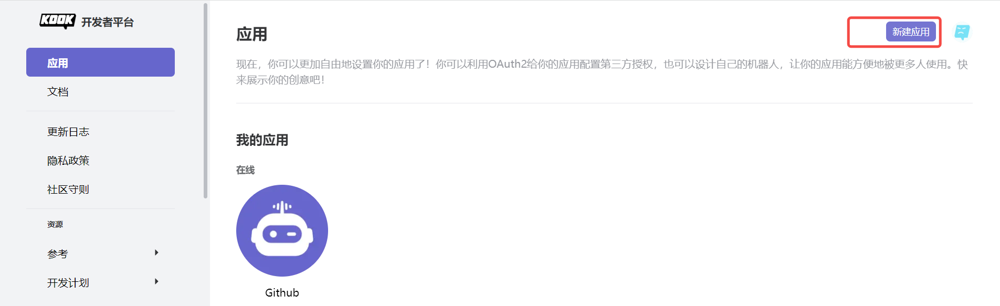
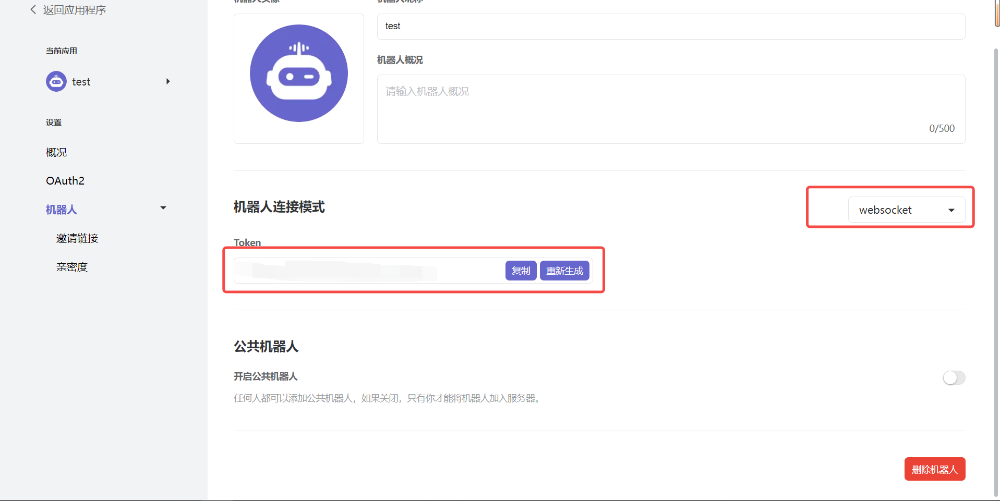
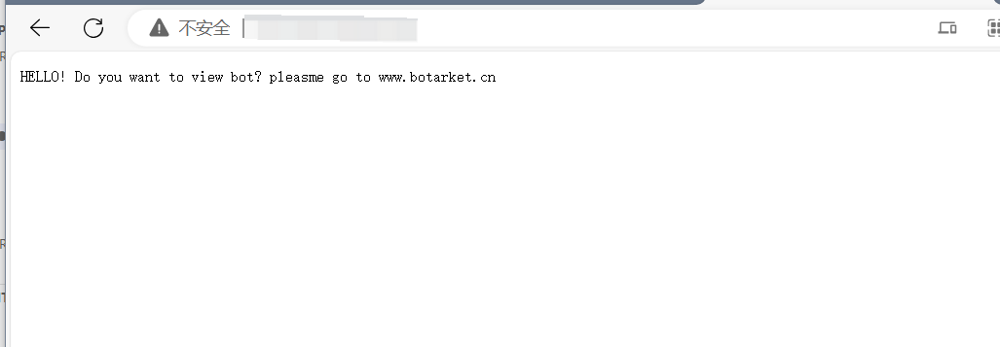
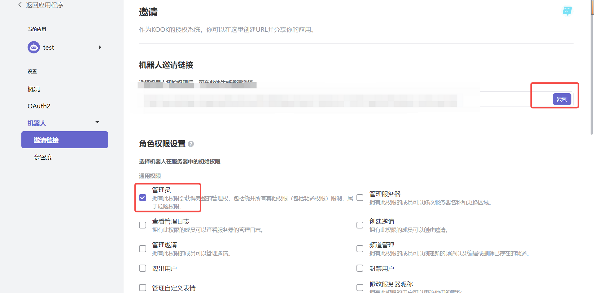
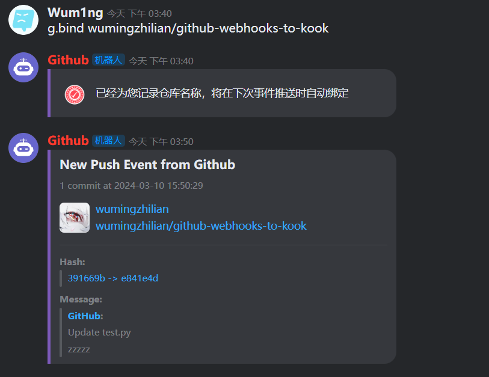
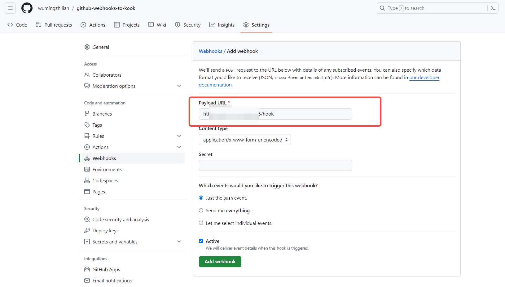

# github-webhooks-to-kook
一款GitHub事件推送的KOOK机器人  [邀请链接](https://www.kookapp.cn/app/oauth2/authorize?id=13188&permissions=14352&client_id=J4JeHxjpdALjb_VT&redirect_uri=&scope=bot)  

## TO DO

- [ ] 增加其他类型Events
- [ ] 卡片模块可进行多选  
- [ ] 使用url后跟channel_id参数进行快速绑定（考虑中） 

## 注意事项

### 配置文件
使用前，请在`code/config`文件夹中添加`config.json`写入你的`kook-bot-token(websocket）`

示例如下
```json
{
    "token":"kook-bot-websocket-token"
}
```
除此之外，还需要在`code/log`文件夹中添加四个空的json文件
```
repo_setting.json
guild_setting.json
did_temp.json
secret.json
```
内容需填为`{}` 否则会影响bot开机加载文件

### 关于event loop报错

bot启动的时候，你可能会接收到下面这个报错。直接忽略即可，其不影响使用

```
/home/muxue/kook/webhook/code/main.py:284: DeprecationWarning: There is no current event loop
  asyncio.get_event_loop().run_until_complete(
/home/muxue/kook/webhook/code/main.py:285: DeprecationWarning: There is no current event loop
  asyncio.gather(web._run_app(app, host='127.0.0.1', port=5461), bot.start()))
```


### 使用指南
首先在kook 官网上新建一个机器人

https://developer.kookapp.cn/app/index


设置websocket 然后保存好token



将本项目部署在公网服务器，或者https://zeabur.com/ 中

按照之前的prepare，将token填入config
运行命令
```
pip3 install -r requirements.txt
python3 main.py
```
然后我们访问
http://[your_ip]:[your_port]
如果有如下文字则部署成功

#### 邀请机器人
在开发者界面，点击邀请链接要请进入我们想要的服务器即可

在某个频道中，绑定github之后，就可以收到push信息


#### 配置github webhook
在setting中，将http://[your_ip]:[your_port]/kook
链接填入其中，即可



#### docker 使用
在当前仓库的目录下执行如下命令
```
docker build -t kook_github .
docke run -d -v "/home/[your_name]/github-webhooks-to-kook:/app/github-webhooks-to-kook:shared" -p 14726:14726 --name kook_github kook_github

```
然后进入docker container 中即可开启
```
cd /app/github-webhooks-to-kook/code
python3 main.py
```
